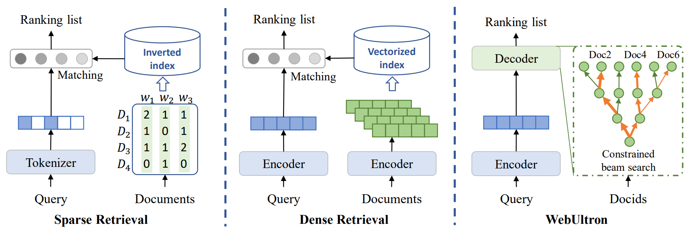

# WebUltron

This is the official repo for our CIKM 2022 long paper "WebUltron: An Ultimate Retriever on Webpages under the Model-centric Paradigm".

## Quick Tour 

In this work, we propose WebUltron, an ultimate retriever on webpages under the model-centric paradigm, which is built on generative language models with a transformer-based encoder-decoder structure. Specifically, we regard document retrieval as a sequence-to-sequence task, which is fed with a query and is asked to output a docid. The comparison among Sparse Retrieval, Dense Retrieval, and WebUltron is visualized as follows:



## Data preparation

#### Data download and preprocess

Download [MS MARCO Document Ranking](https://microsoft.github.io/msmarco/Datasets) and [Natural Questions](https://ai.google.com/research/NaturalQuestions/download) datasets. The downloaded documents should be put into `./dataset/msmarco-data/` and `./dataset/nq-data/`. Download [T5-base](https://huggingface.co/t5-base) model and put into `./transformer_models/t5-base/`.

```
python ./gen_instance/gen_msmarco_sent.py
```

#### Docid representation

The generated docid can be downloaded from [here](https://drive.google.com/drive/folders/1OAshco_o5-1WAs_XvO8zt_tsCO-uhipN?usp=sharing). They should be put into `./dataset/encoded_docid/`. Due to the randomness of ran_300k dataset, the docid representations of rand_300k we provide can only be adapted to the corpus it contains. If you re-sample the document randomly, the docid also needs to be regenerated. 

Example (url_rand_300k):

```
[d1885729]  149,12,5781,3,8578,7,406,9357,2677,2442,5,15,4067,5,287,1
[d2342771]  8,314,200,3266,21,4945,28,884,313,2442,5,8809,9237,5,287,1
[d1270076]  149,307,405,34,240,21,3,9,24746,53,103,162,7,5875,12,20618,58,2442,5,3247,3321,7,5,287,1
...
```

If you prefer to generate docid representations for other datasets (or your own sampled random dataset), you can run the following code. (encoding can be set to pq, url, atomic, and scale can be set to top_300k and rand_300k).

```
cd gen_instance
python gen_t5_encoded_docid.py --encoding pq --scale top_300k 
```

Note that for PQ, you need to pre-compute the embedding of each document based on pre-trained BERT-based or T5-based encoder (such as [DPR](https://github.com/facebookresearch/DPR) and [GTR](https://huggingface.co/sentence-transformers/gtr-t5-base) ) and put the embeddings into `./dataset/doc_embed/t5_512_doc_{scale}.txt` with the following format.

```
[d108472]       0.012844186276197433,0.03927586227655411,...
[d1842]         -0.006592822261154652,0.03644998744130134,...
```

#### Query generation

We follow the [DocTTTTTQuery](https://github.com/castorini/docTTTTTquery) to generate pesudo queries. The generated queries used in this paper can be downloaded from [here](https://drive.google.com/drive/folders/1z_l49uQXn0EpIDSRNyBBjtXE2Jj9cqif?usp=sharing), and should be put into `./dataset/msmarco-data/` and `./dataset/nq-data/`. For each document, we generate 10 pseudo queries for training. You can also generate pseudo queries with your own settings, then output the result in the following format.

```
[d1555982]      what type of energy does a hot glowing star emit
[d1555982]      what type of energy does a glowing star emit
...
```

#### Get training data

For three-stage training, we generate training data by:

```
cd starter_script
python gen_train_data.py --encoding pq --scale top_300k --cur_data general_pretrain
python gen_train_data.py --encoding pq --scale top_300k --cur_data search_pretrain
python gen_train_data.py --encoding pq --scale top_300k --cur_data finetune
```

#### Get evaluation data

To evaluate the model, we generate evaluation data by:

```
cd starter_script
python gen_eval_data.py --encoding pq --scale top_300k
```

## Model training and inference

```
cd starter_script
python train_t5_pipeline.py --encoding pq --scale top_300k
python test_t5.py --encoding pq --scale top_300k
```

## Citation

If you find this repo useful, please consider citing our work:

```
@inproceedings{zhou2022WebUltron,

}
```
